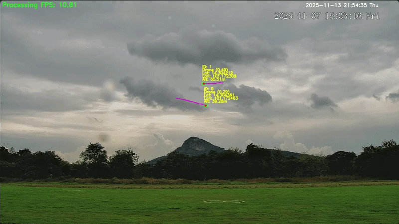

# Hi there, I'm Junior! 👋 🚀

   

  

  

---

### 🏆 My Stats:

  
  

---

### 🛸 Featured Project: YOLOv8 Drone Detection

  <table border="0">
    <tr>
      <td width="50%">
        
      </td>
      <td width="50%">
        <strong>System Overview:</strong> 
        - Real-time detection using YOLOv8 
        - Integrated with MATLAB for control 
        - Hardware: Raspberry Pi  
        - Features: Drone Monitoring 
      </td>
    </tr>
  </table>

---

### 🎧 Current Soundtrack

---

### 🐍 My Contributions in Snake Game
<picture>
  <source media="(prefers-color-scheme: dark)" srcset="https://raw.githubusercontent.com/jujup1t3r/jujup1t3r/output/github-contribution-grid-snake-dark.svg">
  <source media="(prefers-color-scheme: light)" srcset="https://raw.githubusercontent.com/jujup1t3r/jujup1t3r/output/github-contribution-grid-snake.svg">
  
</picture>

---

### 📫 Connect with me

  
  
  

  

